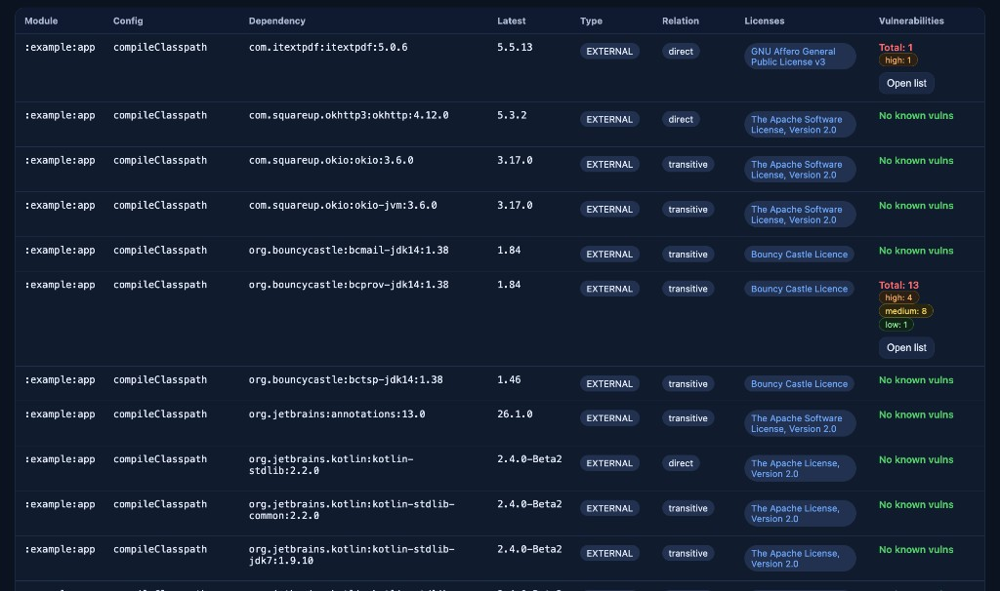
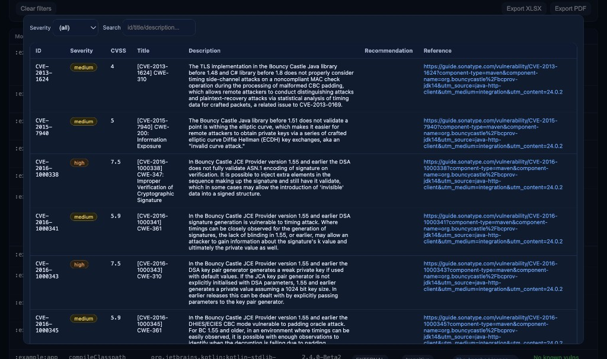

# Gradle-плагин Dependency Analyze

[](https://plugins.gradle.org/plugin/io.github.fso13.dependency-analyze)

Gradle-плагин, который формирует **интерактивный HTML-отчёт** по зависимостям проекта: итоговые координаты артефактов, признак **прямой / транзитивной** зависимости, **лицензии** из Maven POM, **последняя опубликованная версия** (по `maven-metadata.xml`) и **результаты проверки уязвимостей** через [Sonatype OSS Index](https://ossindex.sonatype.org/).

**Документация на английском (основная):** [README.md](README.md)

---

## Зачем нужен плагин

- **Инвентаризация:** Полный список внешних зависимостей и зависимостей вида `project(...)` по модулям и конфигурациям Gradle.
- **План обновлений:** Сравнение **текущей** версии с **последней** доступной в настроенных репозиториях.
- **Лицензии:** Отображение **лицензий** из POM (включая цепочку parent POM), при наличии — со ссылками.
- **Безопасность (SCA):** Запросы к OSS Index; в отчёте — сводка и детали (severity, CVSS, описание, ссылки).
- **Мультимодульность:** Отчёт по одному модулю или **один агрегированный** отчёт по всему дереву проектов.

Отчёт открывается в браузере; есть фильтры и поиск. При необходимости данные (в том числе таблицы уязвимостей) можно **экспортировать** из интерфейса, где это поддерживается.

---

## Требования

- **Gradle:** рекомендуется актуальная версия (в этом репозитории используется версия из `gradle/wrapper/gradle-wrapper.properties`).
- **JVM для плагина:** сборка плагина рассчитана на **Java 17+**.
- **Сеть:** для «последних» версий, POM с лицензиями и OSS Index нужен исходящий HTTPS к репозиториям артефактов и Sonatype (если не отключать сканирование).

---

## Подключение плагина

### Plugins DSL (Gradle Plugin Portal)

Основной идентификатор: **`io.github.fso13.dependency-analyze`**. Для совместимости доступен псевдоним **`io.github.fso13.dependency-analyze-gradle-plugin`** — тот же код.

**`settings.gradle.kts`**

```kotlin
pluginManagement {
  repositories {
    gradlePluginPortal()
    mavenCentral()
  }
}
```

**`build.gradle.kts`**

```kotlin
plugins {
  id("io.github.fso13.dependency-analyze") version "<опубликованная-версия>"
}
```

Вместо `<опубликованная-версия>` укажите версию со страницы плагина на [Gradle Plugin Portal](https://plugins.gradle.org/plugin/io.github.fso13.dependency-analyze).

**`build.gradle` (Groovy)**

```groovy
plugins {
  id 'io.github.fso13.dependency-analyze' version '<опубликованная-версия>'
}
```

### Подпроекты

Подключите плагин в корне и в каждом подпроекте, который должен попасть в отчёт, либо используйте блоки `subprojects { ... }` / `allprojects { ... }` в корневом `build.gradle.kts` (пример — в корневом `build.gradle.kts` этого репозитория).

---

## Как пользоваться

### Задачи

| Задача | Назначение |
|--------|------------|
| **`dependencyAnalyzeReport`** | HTML-отчёт для **текущего** проекта (модуля). |
| **`dependencyAnalyzeAggregate`** (на **корневом** проекте) | Запускает `dependencyAnalyzeReport` во всех проектах, где задача есть, затем **объединяет** строки в один HTML в каталоге `build` корня. |

Из корня репозитория:

```bash
./gradlew dependencyAnalyzeReport
```

Агрегированный отчёт:

```bash
./gradlew dependencyAnalyzeAggregate
```

### Куда сохраняется отчёт

По умолчанию `dependencyAnalyzeReport` пишет файл:

`build/reports/dependency-analyze/index.html`

(относительно **того** проекта, в котором выполняется задача.)

Агрегированная задача записывает в корень:

`build/reports/dependency-analyze/index.html`

Откройте `index.html` в браузере.

Расширение **`dependencyAnalyze`** настраивает **`dependencyAnalyzeReport`** в каждом проекте. Корневая задача **`dependencyAnalyzeAggregate`** собирает уже сгенерированные HTML; у итогового документа заголовок и политика по умолчанию зашиты в плагине (см. исходники при необходимости кастомизации).

---

## Скриншоты

**Обзор зависимостей** — модуль, конфигурация, координаты, последняя версия, тип связи (direct / transitive), лицензии, сводка по уязвимостям.



**Детали уязвимостей** — фильтр по severity, поиск, идентификаторы, CVSS, описание, ссылки (источник данных — OSS Index / Sonatype).



---

## Настройка

Расширение Gradle называется **`dependencyAnalyze`**.

### Kotlin DSL (`build.gradle.kts`)

```kotlin
dependencyAnalyze {
  // Какие конфигурации анализировать (пусто = все resolvable).
  configurationNames.set(setOf("runtimeClasspath", "compileClasspath", "testRuntimeClasspath"))

  includeProjectDependencies.set(true)
  includeTransitives.set(true)

  outputTitle.set("Dependency Analyze Report")

  // Необязательно: свой путь к HTML (в пределах проекта).
  // outputFile.set(layout.buildDirectory.file("reports/my-report.html"))

  vulnerabilityProvider.set("ossIndex") // или "none"
  ossIndexToken.set(providers.environmentVariable("OSSINDEX_TOKEN"))

  // true — при ошибках OSS Index только предупреждение; false — падение задачи.
  ignoreVulnerabilityErrors.set(true)

  // Необязательно: ссылка в шапке отчёта (например, внутренняя политика OSS).
  // policyUri.set("https://example.com/oss-policy")
}
```

### Groovy DSL (`build.gradle`)

```groovy
dependencyAnalyze {
  configurationNames = ['runtimeClasspath', 'compileClasspath', 'testRuntimeClasspath'] as Set
  includeProjectDependencies = true
  includeTransitives = true
  outputTitle = 'Dependency Analyze Report'

  vulnerabilityProvider = 'ossIndex'
  ossIndexToken = System.getenv('OSSINDEX_TOKEN') ?: ''

  ignoreVulnerabilityErrors = true
}
```

### Свойства расширения

| Свойство | Тип | По умолчанию | Описание |
|----------|-----|--------------|----------|
| `configurationNames` | `Set<String>` | пусто | Если **пусто** — все **Resolvable**-конфигурации; иначе только перечисленные по имени. |
| `includeProjectDependencies` | `boolean` | `true` | Включать зависимости `project(...)`. |
| `includeTransitives` | `boolean` | `true` | `true` — полный разрешённый граф внешних зависимостей; `false` — только первый уровень. |
| `outputTitle` | `String` | `"Dependency report"` | Заголовок HTML. |
| `outputFile` | `RegularFile` | `build/reports/dependency-analyze/index.html` | Путь к отчёту (convention задаёт плагин). |
| `vulnerabilityProvider` | `String` | `"ossIndex"` | `"ossIndex"` или `"none"` (без запросов уязвимостей). |
| `ossIndexToken` | `String` | не задан | Токен OSS Index. Без токена API может отвечать **401**, блок уязвимостей может быть пустым. |
| `ignoreVulnerabilityErrors` | `boolean` | `true` | Поведение при ошибках провайдера уязвимостей. |
| `policyUri` | `String` | необязательно | URI для отображения в шапке отчёта. |

Репозитории, объявленные в подпроектах (`repositories { mavenCentral(); ... }`), используются для загрузки POM и `maven-metadata.xml`; для `MavenArtifactRepository` с `PasswordCredentials` поддерживается **Basic**-авторизация.

---

## Токен OSS Index (рекомендуется для данных об уязвимостях)

1. Зарегистрируйтесь и получите токен на [https://ossindex.sonatype.org/](https://ossindex.sonatype.org/) (шаги см. в актуальной документации Sonatype).
2. Передайте токен Gradle, например:

```bash
export OSSINDEX_TOKEN="<ваш-токен>"
```

Или сохраните секрет в `~/.gradle/gradle.properties` (**не** коммитьте его в Git) и прочитайте в скрипте:

```properties
OSSINDEX_TOKEN=<ваш-токен>
```

```kotlin
ossIndexToken.set(providers.gradleProperty("OSSINDEX_TOKEN"))
```

При необходимости объедините `environmentVariable`, `gradleProperty` и свою логику (например `.env`) в одной цепочке `Provider`.

---

## Локальная разработка (`includeBuild`)

Чтобы подключить плагин из клона репозитория без публикации:

**`settings.gradle.kts`**

```kotlin
pluginManagement {
  includeBuild("/path/to/dependency-analize/build-logic")
}
```

**`build.gradle.kts`**

```kotlin
plugins {
  id("io.github.fso13.dependency-analyze")
}
```

(При резолве из `includeBuild` версия в `plugins { }` не указывается.)

---

## Публикация в Gradle Plugin Portal

Для сопровождения: учётная запись и ключи на [plugins.gradle.org](https://plugins.gradle.org/), затем:

```bash
export GRADLE_PUBLISH_KEY="<key>"
export GRADLE_PUBLISH_SECRET="<secret>"
```

Либо `gradle.publish.key` / `gradle.publish.secret` в `~/.gradle/gradle.properties`, и команда:

```bash
./gradlew :build-logic:dependency-analyze-gradle-plugin:publishPlugins
```

---

## Ссылки

- **Страница плагина:** [https://plugins.gradle.org/plugin/io.github.fso13.dependency-analyze](https://plugins.gradle.org/plugin/io.github.fso13.dependency-analyze)
- **Репозиторий:** [https://github.com/fso13/dependency-analyze](https://github.com/fso13/dependency-analyze)
